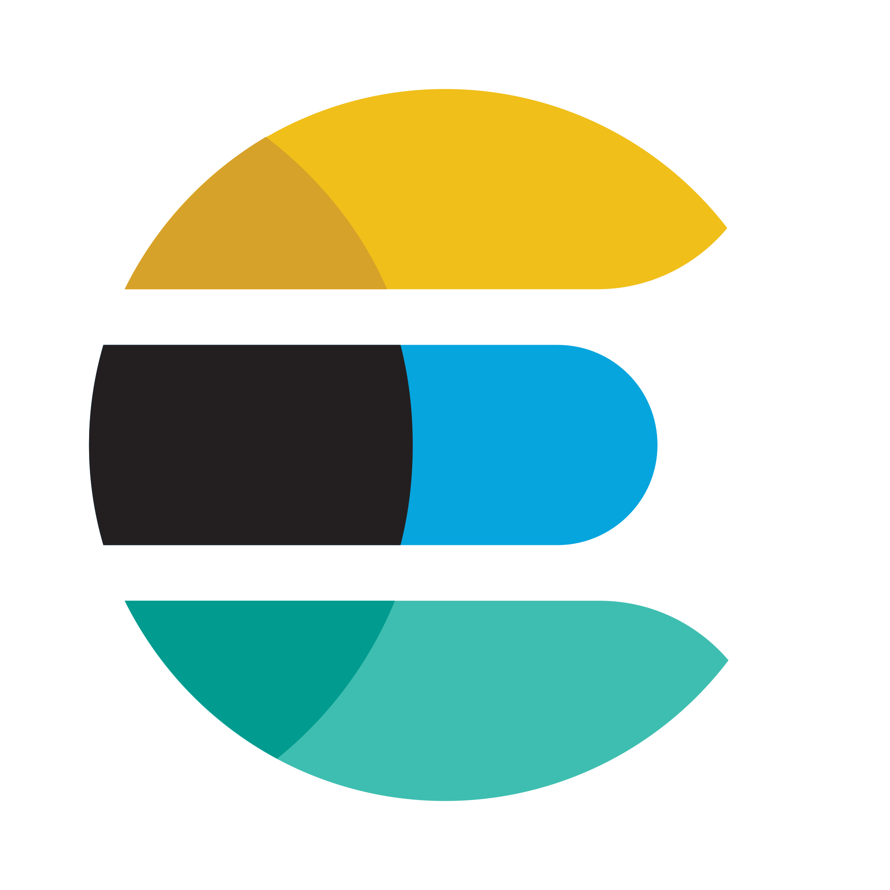

<h2 align="center"> Hi there , I'm Szu-Hsuan.</h2>

    <a href="https://wshs0713.github.io/">Blog</a> •
    <a href="https://www.linkedin.com/in/wshs0713/">LinkedIn</a> •
    <a href="https://twitter.com/wshs0713">Twitter</a>

---

Hi, I'm Szu-Hsuan. I am an easy-going, detail-oriented, problem-solving, and responsible person. 
I like to build great software with new technologies. I always hope that I can keep learning and grow up.

I worked in back-end development for about 4 years. I'm currently working at [DeepWave](https://dwave.cc). DeepWave is a startup with multiple AI audio analysis services. I'm responsible for designing back-end architecture and database schema, building RESTful APIs with Python, Flask, and FastAPI, and maintaining services.

See my [full about page here](https://wshs0713.github.io/about/).

---

### Skills and Tools

    
    
    
    
    
    
    
    
    
    
    
    
    
    
    
    
    
    
    
    
    
    
    
    
    
    
    

